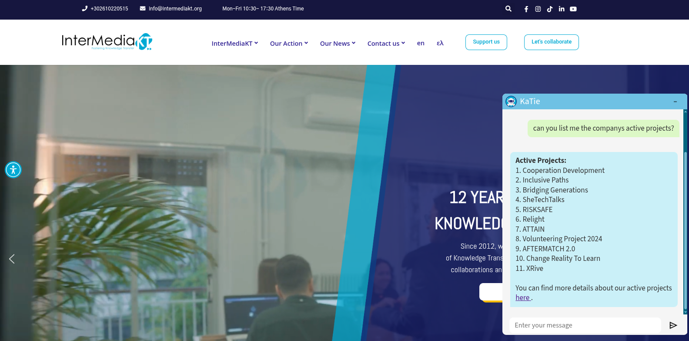

# KaTie Chat Bot
[](https://intermediakt.org)

## Author
Created by [Charalambos Rentoumis](https://github.com/5skr0ll3r)


# Chatbot Documentation

## Table of Contents
- [Overview](#overview)
- [Features](#features)
- [Tech Stack](#tech-stack)
- [Setup & Installation](#setup--installation)
- [Configuration](#configuration)
- [License](#license)
- [Contact](#contact)

---

## Overview

KaTie is a customer assistant chatbot tailored to our companys needs. It helps users get information faster without having to navigate the full website to find what they are looking for. 

---

## Features

- Natural language understanding (NLU)
- Contextual conversation handling (Up to three conversations)
- Multilingual support
- Integrates with any website
- UI responsiveness to cover for usage through mobile devices

---

## Tech Stack

| Component | Technology |
|----------|------------|
| Language | JavaScript |
| Framework | NodeJS |
| Database | Pinecone |
| Modules | http / ws / fs / dotenv / openai / pinecone, rate-limiter-flexible |
| NLP Engine | OpenAI gpt-3.5-turbo |
| Deployment | Azure |
| Frontend | html / css / javascript |

---

## Setup & Installation

### Prerequisites

- Node.js
- NPM
- AZ (Azure CLI Toolkit)

### Steps

```bash
# IR Locally
## Do all inside src/ directory

## Install dependencies
npm install

## Run
node service.js

# IR Azure

## Login (Will open azure site to generate new session, if not logged already in it will prompt you to)
az login

## Zip source code
zip -r chatbot.zip * .[^.]* -x node_modules\* data_preparation\* embeddings/testing-server\* chatbot.zip

- zip: command to zip files
- -r: zip recursivly
- * .[^.]* : 
		- * : match all visible files in the current directory
		- .[^.]* : match hidden files also
- -x: exclude following paterns/files

zip -r <output-file-name> <regex-of-files-to-include> -x <files-to-exclude>

## Deploy to Azure
az webapp deployment source config-zip --resource-group IMKT-Chatbot --name katieChatBot --src chatbot.zip

az webapp deployment source config-zip \
  --resource-group <resource-group-name> \
  --name <webapp-name> \
  --src <path-to-zip-file>
```

---

## Configuration

### .env File
Services configuration file

```env
#Service Configuration
SERVICE_INTERFACE="0.0.0.0" # Interface to listen on (have to also configure the app to use this variable) Default: 127.0.0.1
SERVICE_PORT=8080 # Port to listen on

#Service Security
DOMAIN_WHITELIST="Domain1,Domain2" #Comma seperated values for the only allowed domains

#OpenAI Configuration
OPENAI_API_KEY="" # OpenAI Api Key

#Pinecone Configuration
PINECONE_API_KEY="" # Pinecone Api Key
PINECONE_ENVIRONMENT="" # Pinecone server location
PINECONE_INDEX_NAME="" # Pinecone database name
```

### .deployment File
Azures configuration file
```
[config]
SCM_DO_BUILD_DURING_DEPLOYMENT=true # We set DO_BUILD to true in order for azure to install the npm packages required by the service to run
```

## Code
[CODE.md](./CODE.md)

## License
[Attribution-ShareAlike 4.0 International](./LICENSE.md)

## Contact
Contact us at [charalambos@intermediakt.org](mailto:charalambos@intermediakt.org) or [techsupport@intermediakt.org](mailto:techsupport@intermediakt.org) 